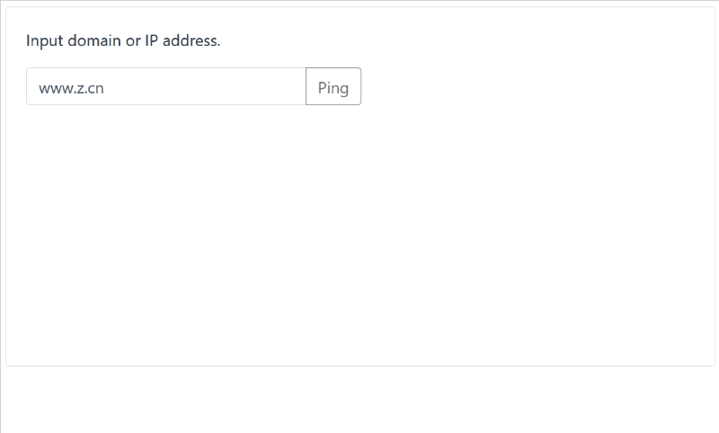

# online-ping-demo

简易在线ping工具，将ping命令输出实时显示到web页面

- python 版本基于(flask | flask-socketio | eventlet)
- nodejs 版本基于(express | socket.io)


### Usage

下载并安装依赖

```shell
git clone git@github.com:sincerefly/online-ping-demo.git
cd online-ping-demo

# python
cd python
pip3 install -r requirements.txt

# nodejs
cd nodejs
npm install
```

### Run

```shell
# python
python3 app.py

Output: 

[dong@nuc5]$ python3 app.py 
 * Restarting with stat
 * Debugger is active!
 * Debugger PIN: 122-644-306
(1390) wsgi starting up on http://0.0.0.0:5000
```

```shell
# nodejs
nodejs index.js
```

### Note

打开浏览器访问

http://[SERVER_IP]:5000





